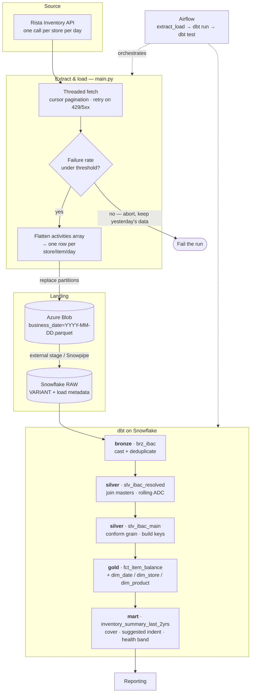

# Inventory Analytics Pipeline

Daily stock movement from a POS system, landed in Snowflake and modelled with dbt, so that operations can answer one question without opening the POS: **how many days of stock does this store have left, and what should it order?**

> **About this repo.** This is an anonymized copy of a pipeline I built and run in production. The architecture, the models and the engineering decisions are unchanged — what I've replaced is the identifying detail: company name, Snowflake account and database/schema names, the storage account, real store and region names, and the replenishment thresholds. The threshold numbers in `dbt_project.yml` are round made-up values, not our actual policy. There are no credentials anywhere in here; `.env.example` and `profiles.yml.example` show the shape of what you'd need to supply.

---

## What it does

The POS knows the inventory position of every item in every store, every day: what the store opened with, what it sold, what it received, what it wasted, what it closed with. That data is reachable through an API, one store and one day per call, and it's genuinely useful — but not in that form. Nobody is going to page through a few hundred API responses to work out that a particular outlet is about to run out of a critical item.

So this pipeline pulls it every morning, flattens it, lands it in Snowflake, and models it into a star schema plus a wide reporting mart. The mart is what people actually open. It carries three derived numbers per store/item/day:

- **days of cover** — closing balance divided by recent average daily consumption
- **suggested indent** — how much to order to get back to the target cover for that location type
- **stock health** — Critical / Normal / Excess, banded off the cover days

Everything upstream of those three columns exists to make them trustworthy.

## Architecture



**Stack:** Python 3.11 (`requests`, `pyarrow`, `PyJWT`) → Azure Blob Storage → Snowflake → dbt (`dbt-snowflake` + `dbt_utils`) → Airflow. Config is environment variables throughout, via `python-dotenv` on the Python side and dbt's `env_var()` on the warehouse side.

---

## How the data moves

### 1. Pulling from the API

The store list comes from the API rather than a hardcoded list, so a new outlet starts flowing the day it's created in the POS — no code change, no one remembering to update a config file.

From there it's a fan-out: every store × every date in the window, run through a `ThreadPoolExecutor`. Each response is paginated with a `lastKey` cursor that has to be followed until it comes back empty. Retries on 429 and 5xx are handled at the transport layer with `urllib3.Retry` and a backoff factor, so a throttled request retries without the calling code knowing about it.

A store that fails outright doesn't raise. It returns `(rows, ok=False)` and the run carries on. That's deliberate — see the next section.

### 2. The circuit breaker

This is the part I'd point at if someone asked what the least obvious decision in the pipeline was.

The load **replaces** whole date partitions rather than appending to them. That's what makes re-runs safe. It's also what makes a partial fetch dangerous: if 40% of stores failed and I wrote what came back, I'd cheerfully overwrite a complete day with a 60% version of itself, and nothing downstream would look broken. The row counts would just be quietly wrong.

So before anything is written, `validate_fetch_quality` aborts the run if:

- the branch failure rate is above `MAX_FAILURE_PERCENT` (default 10%), or
- zero rows came back *and* there were failures — which is the signature of the API being down, as opposed to a genuinely empty day.

Failing the DAG and keeping yesterday's good data is the right outcome here. A red task in Airflow gets looked at. Silently wrong numbers do not.

### 3. Flattening

Each API row carries an `activities` array — sales, purchases, transfers in and out, shrinkage, audit variance, adjustments — of varying length. Exploding it would multiply the rows, and the grain I want downstream is one row per store/item/day. So it gets pivoted instead: two columns per activity type, quantity and cost, joined back onto the base row.

Whatever activity types happen to appear in a given window, the output columns are always the same list in the same order. That stability is what lets the Snowflake `COPY INTO` stay untouched for months at a time.

### 4. Writing Parquet, all strings

Every column is written as a string, including the numbers.

That looks wrong the first time you see it. The reasoning: if the API starts sending `"12.5"` where it used to send `12.5`, or an empty string where a number used to be, I'd rather find out from a `NULL` in a Snowflake column that a test can catch than from the extract dying at 6am with a pyarrow type error. All typing happens in bronze with `try_` casts, where a bad value degrades to `NULL` instead of taking down the load.

The cost is a slightly larger Parquet file. Worth it.

### 5. Partitions, and why they get replaced

One blob per business date: `business_date=2024-05-01.parquet`. Re-running any window overwrites exactly those blobs.

The source restates prior days as corrections land — a stock audit gets keyed in late, a transfer gets amended. An append-only load would accumulate several versions of the same day. Replacing by date makes the pipeline convergent instead: whatever the API currently believes about a date is what the warehouse holds.

One detail that's easy to miss — a date that legitimately returns no rows still gets its old blob deleted. Otherwise a deletion upstream leaves a stale partition sitting there indefinitely, and it will not look like a bug.

### 6. Into Snowflake

An external stage — or Snowpipe, if you want it event-driven — copies each partition into a single `VARIANT` column and stamps three metadata columns: `_SOURCE_FILE`, `_LOAD_DT` parsed out of the blob name, and `_INGESTED_AT`. The DDL is in [`snowflake/raw_ingestion.sql`](snowflake/raw_ingestion.sql).

RAW is a landing zone, not a contract. A new column upstream lands inside the `VARIANT` and breaks nothing.

---

## The models

| Model | Layer | Materialization | Grain | What it does |
|---|---|---|---|---|
| [`brz_ibac`](rista_inventory_analytics/models/bronze/brz_ibac.sql) | bronze | incremental (merge) | date + store + SKU | Casts the `VARIANT` payload, deduplicates late-arriving corrections |
| [`slv_ibac_resolved`](rista_inventory_analytics/models/silver/slv_ibac_resolved.sql) | silver | table | date + store + item | Joins six master tables, computes 7- and 28-day average daily consumption |
| [`slv_ibac_main`](rista_inventory_analytics/models/silver/slv_ibac_main.sql) | silver | table | date + store + product + SKU | Normalizes item names, drops non-stores, builds surrogate keys |
| [`fct_item_balance`](rista_inventory_analytics/models/gold/fct_item_balance.sql) | gold | table | date + store + product + SKU | The fact: balances, costs, and every movement type |
| [`dim_date`](rista_inventory_analytics/models/gold/dim_date.sql) | gold | table | one row per date | Calendar attributes, week/month/quarter boundaries |
| [`dim_store`](rista_inventory_analytics/models/gold/dim_store.sql) | gold | table | one row per store | Region, outlet type, field and area coach |
| [`dim_product`](rista_inventory_analytics/models/gold/dim_product.sql) | gold | table | one row per product | Keyed on the normalized item name |
| [`inventory_summary_last_2yrs`](rista_inventory_analytics/models/gold/inventory_summary_last_2yrs.sql) | mart | table | date + store + product | Cover days, suggested indent, freezer utilisation, health band |

### Bronze: casting and deduplication

Every cast is a `try_` cast, for the reason above. The more interesting half is the `qualify`.

The same business grain can legitimately arrive more than once — a correction lands in a later file for a date that was already loaded. Bronze picks a winner deterministically:

1. newest `_load_dt`
2. then newest `_ingested_at` within that load
3. then whichever payload is more complete
4. then a stable tiebreak on store code, so the result never depends on scan order

The incremental filter looks back 8 days. That comfortably covers the extract's rolling window plus a late file, without rescanning history on every run.

### Silver: the join that will bite you

Six master tables get joined on: outlet category, item category, chest freezer data, freezer capacity, store master, indent cycle. They're maintained as operational spreadsheets, and spreadsheets are not unique on their keys.

If a store appears twice in the store master, a plain left join **doubles every fact row for that store**. Sales double. Costs double. Nothing errors. You find out when somebody asks why one outlet sold twice as much as it possibly could have.

The fix is to dedupe to one row per key *before* the join, not to `DISTINCT` afterwards — by then the damage is done and a duplicated row is indistinguishable from a real one. `STG_STORE_MASTER_DATA` is deduped with a `qualify` that prefers a row with a usable city over one containing a literal `#ERROR!` string, which tells you something about the source system.

The rolling averages use `rows between 6 preceding and current row`, not a range on the date. Worth being precise about: a store/item with no activity produces no row at all, so this averages over the last N *observed* days, not the last N *calendar* days. That matches how the business reads the number, but it does mean an item that sells sporadically shows a higher ADC than a naive calendar average would.

### Silver: keys, and normalizing before hashing

Surrogate keys are `abs(hash(upper(trim(name))))`. The `upper` and `trim` are not cosmetic — item names are typed by hand upstream, and `"Cheese Slice "`, `'Cheese  Slice'` and `Cheese Slice` are three strings that mean one product. Hash them raw and one product becomes three rows in `dim_product`, with three sets of movements that never add up.

So names get stripped of stray quotes and have whitespace runs collapsed before anything is hashed.

The exclusion list at the bottom of that model is a small museum of upstream data quality. `'Loading...'` and `'#REF!'` are spreadsheet artefacts that made it into the store master. And there's a decommissioned outlet that arrives *both* as a clean name and with a trailing newline — which, to Snowflake, are two entirely different stores. Hence the `|| chr(10)`.

### Gold: the mart

Star schema, and then one wide table on top of it, because that is what the reporting layer actually wants.

The three derived columns:

```
cover days       = closing balance / 7-day ADC
suggested indent = ADC × target cover days − closing balance   (0 if already well covered)
health band      = Critical / Normal / Excess, banded on cover days
```

Central and remote locations get different thresholds, because they replenish on completely different cycles. A warehouse restocked twice a week should be running much leaner than a remote location that gets a delivery every few weeks. Hold the warehouse to the remote target and half of it flags Critical every single day — and an alert that is always on gets ignored.

All of those thresholds are **dbt vars**, not literals in the SQL. The policy changes more often than the logic does, and changing a number in `dbt_project.yml` beats editing a `case` statement with six branches. A region with no configured policy falls through to `NULL` rather than being forced into a band that doesn't apply to it.

---

## Data quality & testing

Enforced at each hop rather than asserted once at the end. Roughly in order of how much trouble each one has saved:

**In the extract**

| Guard | Catches |
|---|---|
| Failure-rate circuit breaker | A partial fetch silently replacing a complete day |
| Zero-rows-plus-failures check | The API being down, as distinct from a genuinely empty day |
| Idempotent partition replace | Duplicate rows from a re-run or a backfill |
| Stale-partition deletion | Upstream deletions leaving orphaned data behind |
| Fixed output schema | A missing activity type shifting the column layout |

**In the warehouse**

| Guard | Catches |
|---|---|
| `try_` casts throughout bronze | One malformed value failing an entire build |
| Deterministic `qualify` dedupe | Late corrections duplicating the grain |
| Pre-join dedupe of master tables | Join fan-out inflating every measure |
| Name normalization before hashing | One product splitting across several surrogate keys |

**Declared dbt tests**

| Test | Target | Catches |
|---|---|---|
| `dbt_utils.unique_combination_of_columns` | `slv_ibac_main` on date + store + product + SKU | The grain contract. If this fires, a master table has started fanning out or bronze let a duplicate through |
| `not_null` | surrogate keys in silver and gold | Broken joins, unmapped stores or products |
| source `freshness` | RAW on `_ingested_at`, warn 26h / error 30h | A missed or silently failing run |

The grain test is the one that matters. Everything downstream assumes one row per date/store/product/SKU, and when that stops being true the failure is silent and arithmetic. Better to fail the DAG.

Airflow runs `dbt test` as a required step after every build, so a broken grain stops the pipeline instead of being discovered in a dashboard.

---

## Running it

```bash
python -m venv .venv && source .venv/bin/activate    # Windows: .venv\Scripts\activate
pip install -r requirements.txt

cp .env.example .env                                  # then fill it in
cp rista_inventory_analytics/profiles.yml.example ~/.dbt/profiles.yml
```

Set up the RAW layer once by running [`snowflake/raw_ingestion.sql`](snowflake/raw_ingestion.sql) against your account.

```bash
python main.py                                        # rolling DAYS_BACK window
python main.py --start-date 2024-05-01 --end-date 2024-05-07   # backfill
python main.py --skip-azure                           # fetch + transform, write nothing
```

`--skip-azure` is the one I use most while developing. It exercises the whole fetch and transform path and writes nothing, so row counts can be checked against the POS without touching storage.

```bash
cd rista_inventory_analytics
dbt deps && dbt run && dbt test
```

The Airflow DAG chains all of it: `extract_load → dbt run → dbt test`, daily, with `max_active_runs=1` — overlapping runs would race on the same blobs.

---

## Known limitations

Things I know about and haven't fixed, which is a different list from things I haven't thought about:

- **The dimensions aren't tested for uniqueness.** `dim_store` and `dim_product` are built with `SELECT DISTINCT` over key *plus attributes*, so a store whose attributes disagree across master rows would produce two rows for one key. Adding `unique` tests there — and dealing with whatever they surface — is the obvious next job.
- **ADC treats a missing day as absent, not as zero.** Defensible, and it's what the business expects, but it inflates the average for sporadic sellers. A calendar-spine version would be more correct and would change numbers people are used to, so it needs a conversation before it needs a commit.
- **Cost is carried but not modelled.** Every activity has a cost column and they all flow through to the fact, but nothing downstream does valuation properly. Cost of goods, wastage value, closing stock value — all sitting right there, unused.
- **No CI.** A GitHub Actions job running `dbt build` against a scratch schema on every PR is the highest-value thing missing from this repo.
- **The mart is a full rebuild.** Two years of data, rebuilt daily. Fine at the current volume, and it will not be fine forever; it should go incremental on business date before that becomes a problem rather than after.

## Layout

```
main.py                                  extract → transform → Blob
requirements.txt
.env.example                             required runtime config, no secrets
snowflake/raw_ingestion.sql              Blob → Snowflake RAW: stage, table, COPY / Snowpipe
rista_inventory_analytics/               the dbt project
├── dbt_project.yml                      layer schemas + policy vars
├── profiles.yml.example                 connection shape, env_var only
├── dags/item_balance_dag.py             Airflow
└── models/
    ├── staging/_sources.yaml            sources + freshness
    ├── bronze/                          casting, deduplication
    ├── silver/                          master joins, ADC, conformed grain
    └── gold/                            star schema + mart
```

## License

[MIT](LICENSE).
