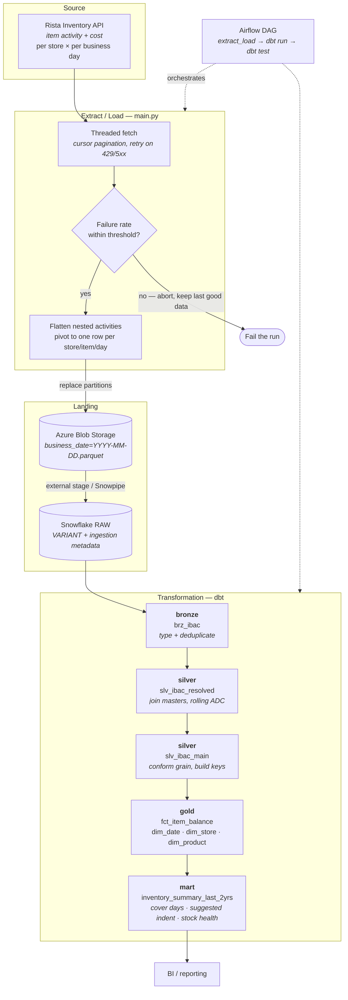

# Inventory Analytics Pipeline — Rista API → Azure Blob → Snowflake → dbt

A daily ELT pipeline that turns per-store inventory movement from a POS API into a tested, dimensional warehouse and a replenishment-decision mart.

> **This is an anonymized version of a production pipeline.**
> The architecture, models, and engineering patterns are real and unchanged. Company name, Snowflake account/database/schema identifiers, storage account names, store and region names, and the replenishment policy thresholds have all been replaced with generic placeholders. No credentials are present in this repository — see [`.env.example`](.env.example) and [`profiles.yml.example`](rista_inventory_analytics/profiles.yml.example) for the configuration the pipeline requires.

---

## Architecture



## Tech stack

| Layer | Technology |
|---|---|
| Extraction | Python 3.11, `requests` + `urllib3.Retry`, `ThreadPoolExecutor`, `PyJWT` |
| Transport format | Apache Parquet (`pyarrow`, snappy) |
| Landing zone | Azure Blob Storage |
| Warehouse | Snowflake (external stage / Snowpipe → `VARIANT` RAW) |
| Transformation | dbt (`dbt-snowflake`), `dbt_utils` |
| Orchestration | Apache Airflow |
| Config | environment variables via `python-dotenv` / dbt `env_var()` |

## Data flow

**1. Source → extract.** [`main.py`](main.py) discovers the store list from the API rather than hardcoding branches, then fans out across stores × dates with a thread pool. Each request follows the API's `lastKey` cursor to exhaustion. A failed store degrades to a warning instead of raising, so one bad branch cannot abort the window.

**2. Quality gate.** The load is a *destructive partition replace*, so a partially successful fetch must never overwrite good data with a subset of it. `validate_fetch_quality` aborts the run if the branch failure rate exceeds `MAX_FAILURE_PERCENT`, or if zero rows came back alongside any failure.

**3. Extract → Blob.** The nested `activities` array is pivoted into one quantity/cost column pair per activity type, producing a stable schema of one row per store/item/day. Every column is written as a **string** — typing is deferred to the warehouse, so an upstream type change can never fail the load. One blob per business date makes re-runs idempotent: the same window overwrites the same blob names rather than appending duplicates.

**4. Blob → Snowflake RAW.** An external stage (or Snowpipe) copies each partition into a single `VARIANT` column and stamps `_SOURCE_FILE`, `_LOAD_DT`, `_INGESTED_AT`. See [`snowflake/raw_ingestion.sql`](snowflake/raw_ingestion.sql). RAW is a landing zone, not a contract — a new upstream column never breaks it.

**5. RAW → bronze → silver → gold → mart.** Described below.

## Model reference

| Model | Layer | Materialization | Grain | What it does |
|---|---|---|---|---|
| [`brz_ibac`](rista_inventory_analytics/models/bronze/brz_ibac.sql) | bronze | incremental (merge) | Date + Store + SKU | Types the `VARIANT` payload with `try_` casts; deduplicates late-arriving corrections via `qualify`, preferring the newest load and the most complete payload. 8-day incremental lookback. |
| [`slv_ibac_resolved`](rista_inventory_analytics/models/silver/slv_ibac_resolved.sql) | silver | table | Date + Store + Item | Joins six business master tables; computes trailing 7- and 28-day average daily consumption (ADC) with window functions. |
| [`slv_ibac_main`](rista_inventory_analytics/models/silver/slv_ibac_main.sql) | silver | table | Date + Store + Product + SKU | Normalizes item names, drops non-store rows, builds `DATE_KEY` / `STORE_KEY` / `PRODUCT_KEY` surrogate keys. The single source the gold layer reads. |
| [`fct_item_balance`](rista_inventory_analytics/models/gold/fct_item_balance.sql) | gold | table | Date + Store + Product + SKU | Fact: opening/closing balance and cost, plus every movement type — sales, purchase, transfers in/out, shrinkage, audit variance, adjustments. |
| [`dim_date`](rista_inventory_analytics/models/gold/dim_date.sql) | gold | table | one row per date | Calendar attributes: week/month/quarter boundaries, leap-year and month-end flags. |
| [`dim_store`](rista_inventory_analytics/models/gold/dim_store.sql) | gold | table | one row per store | Region, outlet type, and field/area coach ownership. |
| [`dim_product`](rista_inventory_analytics/models/gold/dim_product.sql) | gold | table | one row per product | Keyed on the normalized item name. |
| [`inventory_summary_last_2yrs`](rista_inventory_analytics/models/gold/inventory_summary_last_2yrs.sql) | mart | table | Date + Store + Product | Days of cover, suggested indent quantity, freezer space utilization, and a Critical / Normal / Excess stock health band. |

### The mart's business logic

Three questions, one model:

- **How long will stock last?** `Closing_Balance / ADC_7_Days` → days of cover.
- **How much should be ordered?** `ADC_7_Days × target_cover_days − Closing_Balance`, or zero when already well covered.
- **Is this position healthy?** Cover days bucketed into Critical / Normal / Excess.

Central and remote locations replenish on different cycles, so each gets its own thresholds. All of them are **dbt vars** in [`dbt_project.yml`](rista_inventory_analytics/dbt_project.yml) rather than literals in SQL — the policy can be tuned without touching a model, and a different deployment can run a different policy.

> The threshold values committed here are illustrative placeholders, not a real service-level policy.

## Data Quality & Testing

Quality is enforced at every hop, not just asserted at the end.

**In the extract**

- **Circuit breaker.** The run aborts before writing anything if the branch failure rate exceeds `MAX_FAILURE_PERCENT`, or if the API returned zero rows alongside failures. Yesterday's good partition survives a bad API day.
- **Idempotent writes.** One blob per business date, replaced wholesale. Re-running any window is safe. A date that legitimately returns no rows still has its stale blob deleted, so upstream deletions propagate instead of leaving orphans.
- **Schema stability.** Output columns are always the same list in the same order, regardless of which activity types the API happened to return.

**In the warehouse**

- **Non-failing casts.** Every bronze cast is `try_to_date` / `try_to_number` / `try_to_double`. One malformed value becomes `NULL` instead of failing the build.
- **Deduplication at the source of the problem.** Late-arriving corrections mean the same business grain can appear in multiple files. Bronze resolves this with a deterministic `qualify`: newest load, then newest file, then the more complete payload, then a stable tiebreak.
- **Fan-out prevention.** The business master tables arrive from operational spreadsheets and are *not* unique on their join keys. `STG_STORE_MASTER_DATA` is deduped to one row per outlet **before** the join — deduping afterwards would have silently multiplied fact rows and inflated every measure.
- **Key normalization.** Item names are hand-entered upstream. They are stripped of stray quotes and have whitespace runs collapsed before hashing, so the same product cannot land under two different `PRODUCT_KEY`s.

**Declared dbt tests**

| Test | Target | Catches |
|---|---|---|
| `dbt_utils.unique_combination_of_columns` | `slv_ibac_main` on Date + Store + Product + SKU | The grain contract — fires if a master table starts fanning out or bronze dedupe lets a duplicate through |
| `not_null` | surrogate keys in silver and gold | Broken joins, unmapped stores or products |
| source `freshness` | RAW table on `_ingested_at` | A missed or silently failing daily run (warn at 26h, error at 30h) |

Run them with `dbt test`; the Airflow DAG runs `dbt test` as a required step after every build.

## Repository layout

```
.
├── main.py                              # extract → transform → Blob
├── requirements.txt
├── .env.example                         # required runtime config (no secrets)
├── snowflake/
│   └── raw_ingestion.sql                # Blob → Snowflake RAW: stage, table, COPY / Snowpipe
└── rista_inventory_analytics/           # dbt project
    ├── dbt_project.yml                  # layer schemas + business policy vars
    ├── packages.yml
    ├── profiles.yml.example             # Snowflake connection shape (env_var only)
    ├── dags/
    │   └── item_balance_dag.py          # Airflow: extract_load → dbt run → dbt test
    └── models/
        ├── staging/_sources.yaml        # source definitions + freshness
        ├── bronze/                      # typing + deduplication
        ├── silver/                      # enrichment, ADC, conformed grain
        └── gold/                        # star schema + BI mart
```

## Running it

```bash
# 1. Install
python -m venv .venv && source .venv/bin/activate   # Windows: .venv\Scripts\activate
pip install -r requirements.txt

# 2. Configure — fill in your own values, never commit the result
cp .env.example .env
cp rista_inventory_analytics/profiles.yml.example ~/.dbt/profiles.yml

# 3. Set up the RAW layer (once)
#    Run snowflake/raw_ingestion.sql against your Snowflake account.

# 4. Extract and load
python main.py                                    # rolling DAYS_BACK window
python main.py --start-date 2024-05-01 --end-date 2024-05-07   # explicit backfill
python main.py --skip-azure                       # dry run: fetch + transform, write nothing

# 5. Transform and test
cd rista_inventory_analytics
dbt deps
dbt run
dbt test
```

## Design notes & known limitations

- **Why strings in Parquet?** Deferring all typing to bronze means an upstream API type change surfaces as `NULL`s in one column, visible to tests — not as a hard failure of the extract at 06:00.
- **Why a full partition replace instead of an append?** The source restates prior days as corrections land. Replace-by-date makes the pipeline convergent: whatever the API currently believes about a date is what the warehouse holds.
- **Row-based, not range-based, ADC windows.** A store/item with no activity produces no row, so the trailing averages are over the last *N observed days*, not the last *N calendar days*. This matches how the business reads the number, but it is a real distinction worth knowing.
- **The dimensions are not tested for uniqueness.** `dim_store` and `dim_product` are built with `SELECT DISTINCT` over key + attributes, so a store whose attributes disagree across master rows could produce two rows for one key. Adding `unique` tests there — and resolving the conflicts they surface — is the natural next step.
- **No CI.** A GitHub Actions workflow running `dbt build` against a scratch schema on every PR would be the highest-value addition to this repo.

## License

[MIT](LICENSE)
